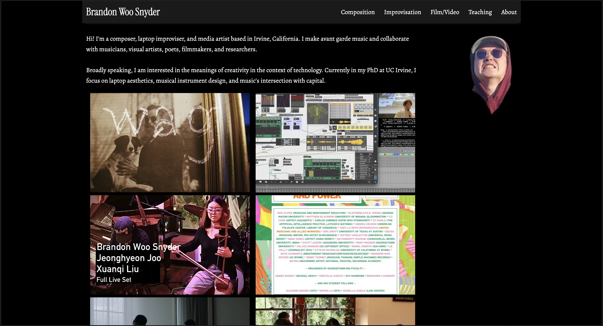
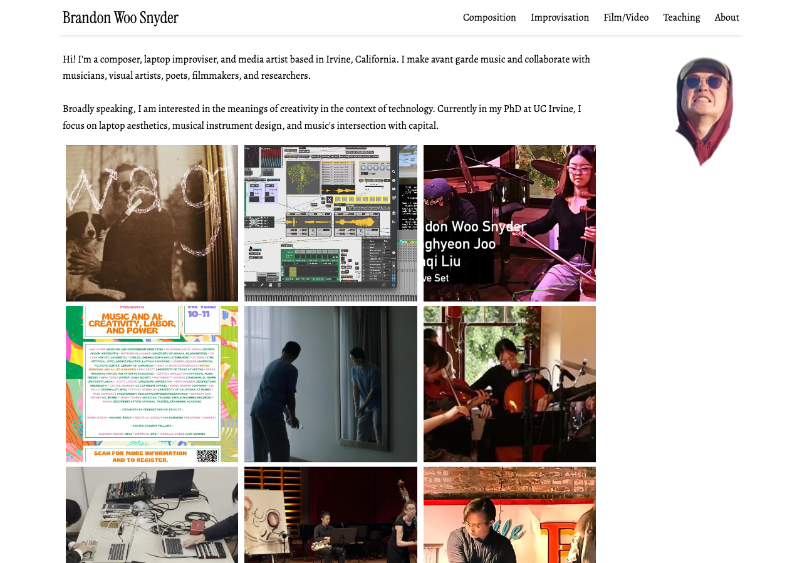

# Style Reference

## Dark Theme (current)



### `assets/css/main.scss`
```
$brand-color: white;
```

### `_sass/_base.scss`
```scss
body {
  background: #000;
  color: #fff;
}
blockquote {
  border-left: 0.25em solid #555;
  color: #aaa;
}
table, th, td {
  border: 1px solid #555;
}
```

### `_sass/_header.scss`
| Selector | Change to |
|---|---|
| `.site-header` | `background-color: #1a1a1a; box-shadow: 0 5px 6px -6px #444;` |
| `.dropbtn` | `background-color: #1a1a1a; color: white;` |
| `.dropdown-content` | `background-color: #1a1a1a;` |
| `.dropdown-content a` | `color: white;` |
| `.dropdown-content a:hover` | `background-color: #3a3a3a;` |
| `.dropdown:hover .dropbtn` | `background-color: #3a3a3a;` |

### `_sass/_footer.scss`
| Selector | Change to |
|---|---|
| `.footer` | `background: #1a1a1a;` |
| `.footer-description` | `color: #aaa;` |

### `_sass/_home.scss`
| Selector | Change to |
|---|---|
| `.featured-post` | `color: #fff;` |
| `.featured-post-overlay` | `background: rgba(0, 0, 0, 0.65);` |

### `_sass/_page.scss`
| Selector | Change to |
|---|---|
| `a.pdf-button` | `border: 1px solid #666; color: #fff;` |
| `a.pdf-button:hover` | `background: #1a1a1a;` |
| `.tabular-entry p` | `color: #aaa;` |

### `_sass/_default.scss`
| Selector | Change to |
|---|---|
| `.loading-spinner` | `border: 3px solid rgba(255, 255, 255, 0.1); border-top-color: #fff;` |
| `.scroll-error` | `color: #aaa;` |

### `_sass/_post.scss`
| Selector | Change to |
|---|---|
| `.post-date` | `color: #aaa;` |

### `_sass/_code.scss`
| Selector | Change to |
|---|---|
| `code` | `background-color: #1a1a1a;` |
| `pre` | `background-color: #1a1a1a;` |

### `assets/css/syntax.css`
Use the dark-themed syntax file (current contents — muted, high-contrast colors for `#000` background).

---

## White Theme (original)



### `assets/css/main.scss`
```
$brand-color: black;
```

### `_sass/_base.scss`
```scss
body {
  /* remove background and color — defaults to white bg / black text */
}
blockquote {
  border-left: 0.25em solid #ccc;
  color: #999;
}
table, th, td {
  border: 1px solid black;
}
```

### `_sass/_header.scss`
| Selector | Change to |
|---|---|
| `.site-header` | `background-color: white; box-shadow: 0 5px 6px -6px #bbb;` |
| `.dropbtn` | `background-color: white; color: black;` |
| `.dropdown-content` | `background-color: #f9f9f9;` |
| `.dropdown-content a` | `color: black;` |
| `.dropdown-content a:hover` | `background-color: #f1f1f1;` |
| `.dropdown:hover .dropbtn` | `background-color: #f1f1f1;` |

### `_sass/_footer.scss`
| Selector | Change to |
|---|---|
| `.footer` | `background: white;` |
| `.footer-description` | `color: #9a9a9a;` |

### `_sass/_home.scss`
| Selector | Change to |
|---|---|
| `.featured-post` | `color: #121212;` |
| `.featured-post-overlay` | `background: rgba(255, 255, 255, 0.65);` |

### `_sass/_page.scss`
| Selector | Change to |
|---|---|
| `a.pdf-button` | `border: 1px solid #ccc; color: #333;` |
| `a.pdf-button:hover` | `background: #f5f5f5;` |
| `.tabular-entry p` | `color: #666;` |

### `_sass/_default.scss`
| Selector | Change to |
|---|---|
| `.loading-spinner` | `border: 3px solid rgba(0, 0, 0, 0.1); border-top-color: #333;` |
| `.scroll-error` | `color: #666;` |

### `_sass/_post.scss`
| Selector | Change to |
|---|---|
| `.post-date` | `color: #9a9a9a;` |

### `_sass/_code.scss`
| Selector | Change to |
|---|---|
| `code` | `background-color: #f5f5f5;` |
| `pre` | `background-color: #f5f5f5;` |

### `assets/css/syntax.css`
Use the [Pygments default light syntax](https://github.com/jekyll/jekyll/blob/master/lib/site_template/assets/css/syntax.css) (original light-background colors).
